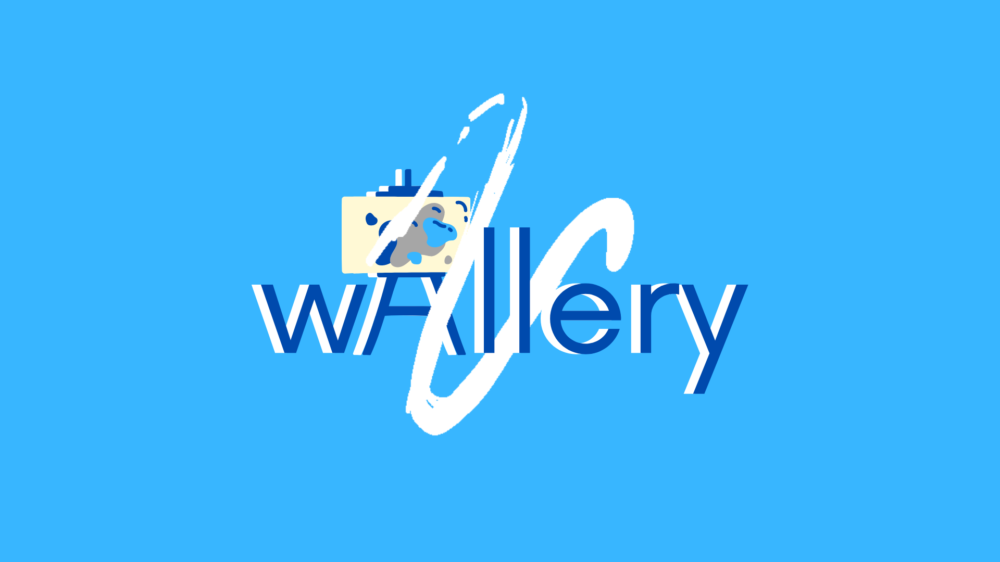

# Wallery
Art that makes you move.
Dream a world where art exhibitions took place in virtual spaces, visible only to those interested, having no space limit and setup cost. A chance for artists to exhibit their work and sell it as NFT.

Pitch video link:

## Inspiration
Going to a gallery abroad in New York from Zurich is hard. Why not bring the artwork to your town, and explore it while incorporating movement to your life?

## What it does
The project enables artist to have their work published on various landscapes all over the world. Art-lovers on the other hand, get to see and buy the NFTs of the artists by finding them walking around close to artwork's location. 

## How we built it
We develop our application for iOS, using augmented reality framework ARKit. For NFT creation and transaction, we choose Solana network.

## Features
With our application, artists can create their NFT's, publish it on specific location and have their art viewed by curious eyes. An interested person can purchase it through decentralized network, which enables direct transaction.  

- Artists can have loyalties for their artwork, which is not possible on traditional world. Normally, if an artwork has sold to someone, that person can sell it to someone else and artist can't take any profit from it. With our app, we give artist an opportunity to take loyalties from occuring purchases.

- Liberating art environment. Currently, most artwork needs an exhibition or a gallery to be viewed. Our app gives artist the chance to share their work viewed in any location.

- Mobility for buyers. The world is moving into a direction where people pushed into their homes, it is whether frustrating, if not irritating to enjoy a good time. The new generation has enormous time spent on their home, sitting or lying, which creates unhealthy conditions for their body. Another interesting thing about the new generation is their interest on decentralization of internet, blockchain technologies have it's young followers . We give people to stroll in newly installed galleries and explore the city in a brand new way.

## What's next 

We believe the scene will only here to expand, having different mediums of art everywhere in earth. We believe it would be a nice touch to add 3D reconstructed sculptures, generated performances and reality bending architectural installments. We would like to provide tools for art world to create their on environment in their own settings, having less boundaries for this world.

